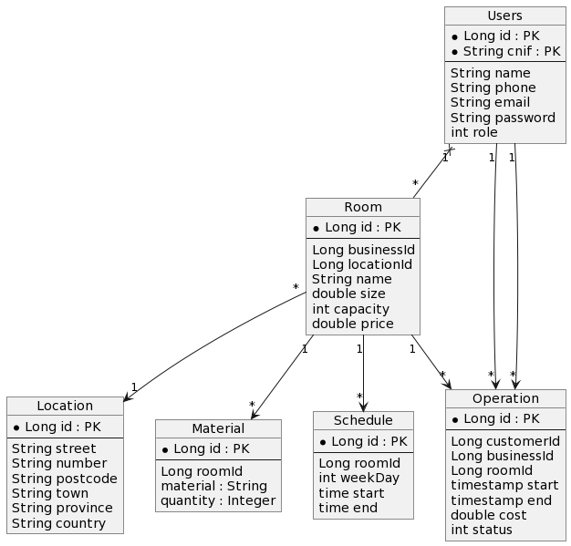

# ReservaTuSala-Back

## Introduction
In this repository we have the backend of ReservaTuSala, a web application for managing meeting room reservations. The project has been developed with Java Spring Boot and works with a PostgreSQL database in a Docker container. The frontend of the project is available in [this repository](https://github.com/kikegb/ReservaTuSala-front).


## Getting Started

### Prerequisites
1. Have Docker-Compose installed.
2. Have Maven installed.

### Installation
1. Clone this repository.
   ```shell
   git clone https://github.com/kikegb/ReservaTuSala-back.git
   ```
2. Move to the new directory.
   ```shell
   cd ./reservatusala-back
   ```
3. Execute the command line below to set up the database docker container using docker compose.
   ```shell
   docker-compose up -d
   ```
4. Run the application.
   ```shell
   mvn spring-boot:run
   ```

### Swagger
With the application running, the Swagger API documentation is available [here](http://localhost:8081/swagger-ui/index.html).
   
## Database schema
We use a database to store all the information following the schema showed in the image below.



